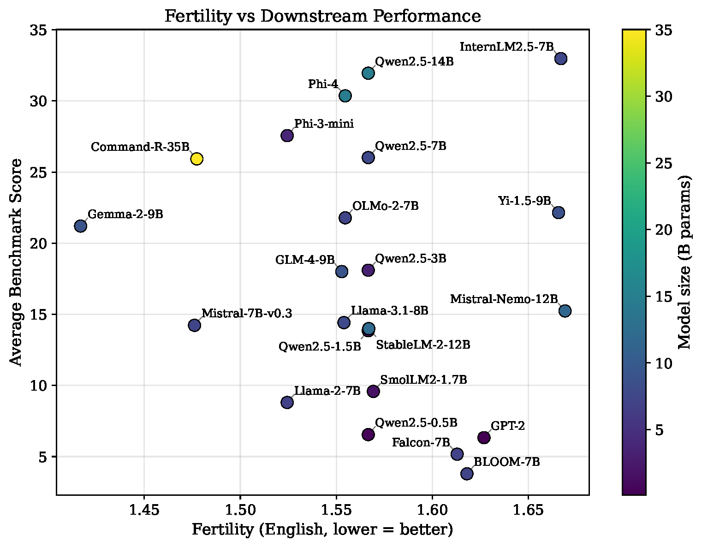
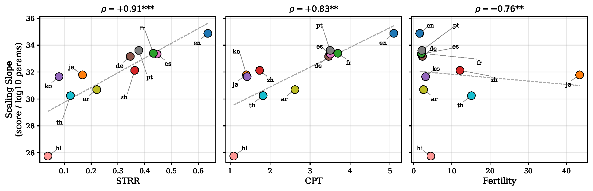

# TokLens: A Multilingual Lens on Tokenizer Quality for LLMs

Accepted to ACL 2026 SRW. 🎉

Open-source toolkit for evaluating tokenizer quality across languages using six intrinsic metrics. We evaluate 24 tokenizers from major LLM families across 15 typologically diverse languages and correlate with downstream performance.

## Key Findings

1. **Stark cross-lingual disparities persist.** GPT-2 produces 56x more tokens per word in Japanese than English. Qwen2.5 and Gemma-2 reduce this gap to under 4x.
2. **No metric predicts English benchmark performance** after controlling for model size (Bonferroni-corrected). Tokenizer quality does not drive English leaderboard scores.
3. **STRR significantly predicts multilingual performance.** On MMLU-ProX, linear mixed-effects models show STRR has a large positive effect (β = +5.7, z = 18.5, p < 0.001).
4. **Higher STRR correlates with steeper scaling.** A controlled experiment on the Qwen2.5 family (fixed tokenizer, varying model size) shows languages with higher STRR scale more steeply (ρ = 0.91, p < 0.001).

### Fertility vs. average benchmark score



### Per-language scaling slope vs. tokenizer metrics (Qwen2.5 family)



## Metrics

| Metric | Description |
|---|---|
| Fertility | Tokens per whitespace-delimited word. Lower = better compression. |
| CPT | Characters per token. |
| Compression ratio | Bytes per token. |
| NSL | Normalized sequence length relative to a reference tokenizer. |
| STRR | Single-token retention rate. Fraction of words encoded as a single token. |
| Parity | Cross-lingual fairness: ratio of token counts for parallel English sentences. |

## Models and Languages

22 models with Open LLM Leaderboard v2 scores, plus 2 extra tokenizers (Qwen3, DeepSeek-V3) for metric-only analysis.

15 languages across 6 scripts: English, Chinese, Japanese, Arabic, Hindi, German, Turkish, Korean, Thai, Russian, French, Spanish, Portuguese, Vietnamese, Indonesian.

## Quickstart

```bash
pip install toklens
```

```python
from toklens import Analyzer

analyzer = Analyzer.from_pretrained("meta-llama/Llama-3.1-8B")
report = analyzer.evaluate(langs=["en", "zh", "ja", "ar"])
report.print_table()
```

```bash
toklens eval meta-llama/Llama-3.1-8B --langs en zh ja ar
toklens compare meta-llama/Llama-2-7b-hf meta-llama/Llama-3.1-8B
```

## Experiments

Reproduces the full evaluation. Run steps in order:

```bash
uv run python -m experiments.pipeline.01_collect_benchmarks
uv run python -m experiments.pipeline.02_compute_metrics
uv run python -m experiments.pipeline.03_correlation
uv run python -m experiments.pipeline.04_figures
```

Supplementary analyses (LME models, Qtok comparison, BPB, Qwen scaling) are in `experiments/analyses/`. See `experiments/README.md` for details.

## License

MIT
